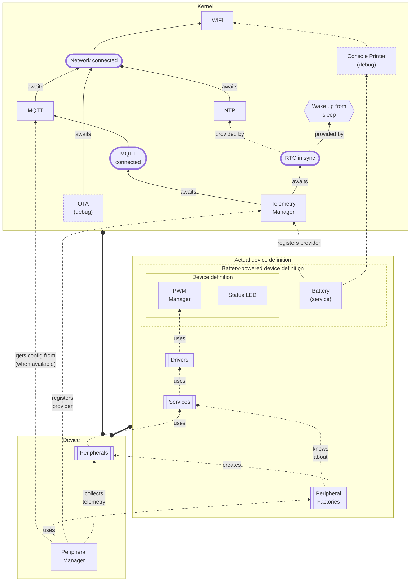

# Architecture

```mermaid
graph BT
    subgraph Kernel["Kernel"]
        direction BT

        OTA["OTA\n(debug)"]
            style OTA stroke-dasharray: 4
        ConsolePrinter["Console Printer\n(debug)"]
            style ConsolePrinter stroke-dasharray: 4

        WiFi
        NetworkConnected(["Network connected"])
            style NetworkConnected stroke-width:4
        NTP
        RTCInSync(["RTC in sync"])
            style RTCInSync stroke-width:4
        MQTT
        MQTTConnected(["MQTT\nconnected"])
            style MQTTConnected stroke-width:4
        TelemetryManager["Telemetry\nManager"]

        NetworkConnected --> WiFi
        OTA -->|awaits| NetworkConnected
        MQTT -->|awaits| NetworkConnected
        MQTTConnected --> MQTT
        NTP -->|awaits| NetworkConnected
        RTCInSync -.->|provided by| NTP
        RTCInSync -.->|provided by| PreBoot{{"Wake up from\nsleep"}}
        TelemetryManager -->|awaits| MQTTConnected
        TelemetryManager -->|awaits| RTCInSync

        ConsolePrinter -.-> WiFi
    end

    subgraph ActualDeviceDefinition["Actual device definition"]
        direction BT

        subgraph BatteryDeviceDefinition["Battery-powered device definition"]
            direction BT
            %% We might have a device that has a battery or not
            style BatteryDeviceDefinition stroke-dasharray: 4

            subgraph DeviceDefinition["Device definition"]
                direction BT

                StatusLED["Status LED"]
                PwmManager["PWM\nManager"]
            end

            Battery["Battery\n(service)"]

            Battery -.->|registers provider| TelemetryManager
        end

        Battery -.-> ConsolePrinter

        Drivers[["Drivers"]]
        Services[["Services"]]
        PeripheralFactories[["Peripheral\nFactories"]]

        Services -.->|uses| Drivers
    end

    Drivers -.->|uses| PwmManager

    subgraph Device["Device"]
        Peripherals[["Peripherals"]]
        PeripheralManager["Peripheral\nManager"]
    end

    PeripheralManager -.->|"gets config from\n(when available)"| MQTT
    PeripheralManager -.->|uses| PeripheralFactories

    PeripheralFactories -.->|knows\nabout| Services
    PeripheralFactories -.->|creates| Peripherals

    PeripheralManager -.->|"registers\nprovider"| TelemetryManager
    PeripheralManager -.->|"collects\ntelemetry"| Peripherals

    Peripherals -.->|uses| Services

    Device o==o Kernel
    Device o==o ActualDeviceDefinition

```
