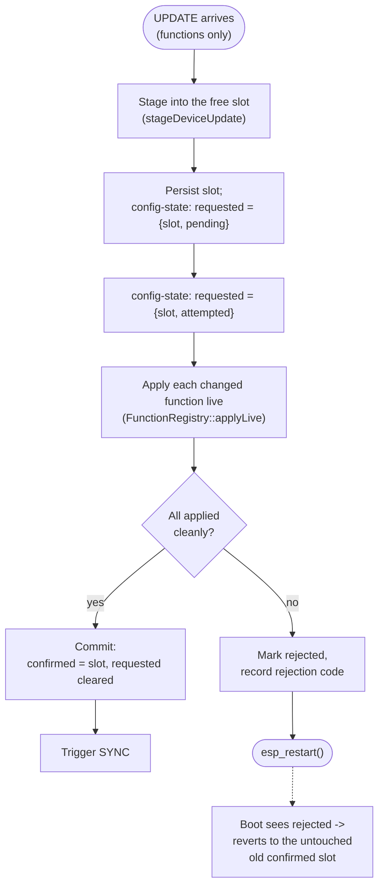
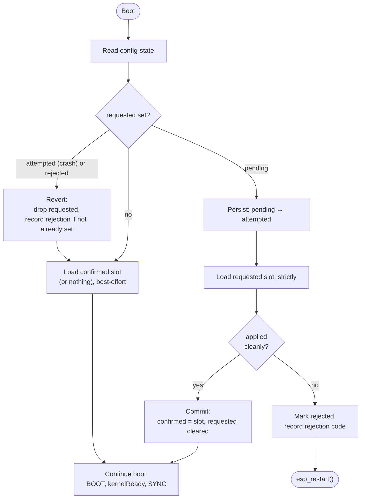

# Configuration

How a device's configuration is stored, applied, and reconciled with the server. This document
describes the current firmware implementation. For the full protocol design and rationale (server
side, wire formats, phased rollout), see
[`specs/done/config-reconciliation.md`](specs/done/config-reconciliation.md) — that document also tracks what
is and isn't built yet via its progress checklist; this one describes what's actually running.

## Concepts

- **Device configuration**, **function configuration**, and **network configuration** are each a
  **reconciled configuration**: a JSON body the server authored, identified by an opaque
  **fingerprint** token. The firmware never computes or reinterprets a fingerprint — it only stores
  and echoes back whatever the server sent, so a serialization difference between server and
  firmware can never cause the two to disagree about whether a configuration has changed.
- Each configuration is persisted as an **envelope**: `{data, fingerprint, requestedAt}`, with
  `data` kept byte-for-byte verbatim. See [`ConfigEnvelope`](../components/kernel/src/config/ConfigEnvelope.hpp)
  / [`StoredConfig`](../components/kernel/src/config/StoredConfig.hpp).
- The device holds up to two full configuration sets (device + network + every function) at once,
  in interchangeable **slots** named `a`/`b`. A small **`config-state`** record says which slot is
  **`confirmed`** (last-known-good, what the device actually boots and runs) and, while a new set
  is being tried, which slot is **`requested`** and how far it's gotten. See
  [`ConfigState`](../components/kernel/src/config/ConfigState.hpp) /
  [`ConfigStateStore`](../components/kernel/src/config/ConfigStateStore.hpp).
- Applying `confirmed` at boot is **best-effort**: a peripheral or function that fails to apply is
  reported as an error, but the device still boots and runs. Applying a `requested` set is
  **strict**: any failure reverts to `confirmed` and reboots. See
  [`decideBootPlan`/`recordStrictBootOutcome`](../components/kernel/src/config/ConfigBootPlan.hpp).
- Three MQTT messages carry all of this: the device announces itself on **`BOOT`**, advertises what
  it's actually running on **`SYNC`**, and receives new configuration on **`UPDATE`**.

## BOOT, SYNC, UPDATE

All three sit directly under the device's MQTT topic root. For devices that have been
re-addressed (network-config has an `id` field), this is `d/{id}/...`; for legacy devices still
pending migration, it's `.../devices/ugly-duckling/$INSTANCE`. See
[`specs/device-readdressing.md`](specs/device-readdressing.md) for the migration design.

| Topic | Direction | Retention / QoS | Carries |
| --- | --- | --- | --- |
| `boot` | device → server | `NoRetain`, `QoS 2` | Diagnostics: model/revision/platform, reset/wakeup reason, boot count, per-peripheral/function apply errors, and (see *Rejection reporting* below) a rejection code, if one is pending. **No configuration bodies.** |
| `sync` | device → server | `NoRetain`, `QoS 2` | The fingerprint manifest of what the device has **applied and booted with** — `device`, `network`, and every function — proof-of-apply, not proof-of-receipt. Built from live in-memory state, never re-derived from NVS. Also carries a rejection code (see *Rejection reporting* below) on the first `SYNC` published after a revert, alongside `BOOT`. |
| `update` | server → device | `NoRetain`, `QoS 2` | New configuration: `{configurations: {device: envelope, network: envelope, <function>: envelope, ...}}`. |

- **`BOOT`** is published once per boot, from [`startDevice()`](../components/devices/src/Device.hpp)
  (`mqttRoot->publish("boot", ...)`), unconditionally as soon as peripherals/functions finish
  initializing.
- **`SYNC`** is published by a dedicated task
  ([`initSyncTask`](../components/devices/src/Device.hpp)) triggered by a single-element overwrite
  queue: every successful MQTT (re)connection, and immediately after a successful hot-reload
  `UPDATE`. It always waits for `kernelReady` first, so it only ever reports a fully-booted set.
  There is no boot-time `SYNC` separate from the connection trigger. The `device` entry's
  fingerprint/requestedAt are captured once at boot (from the `StoredConfig` `startDevice()` loaded)
  and passed through unchanged for the life of the process — a device configuration change is never
  hot-reloaded, only ever applied across a reboot (below), so that snapshot never goes stale.
- **`UPDATE`** is handled by [`registerUpdateHandler`](../components/devices/src/Device.hpp): it
  filters the incoming configurations against currently-held fingerprints (an entry whose
  fingerprint already matches is dropped; if nothing differs, the whole message is a no-op — see
  [`filterUpdate`](../components/kernel/src/UpdateFilter.hpp)), then **always stages into the free
  slot first**, whether the device document changed or only functions did: every configuration the
  device is currently confirmed/running as (the `device` document plus every live function's
  envelope) is read and merged with what the `UPDATE` actually changed — via
  [`stageDeviceUpdate`](../components/kernel/src/config/ConfigStaging.hpp), a pure function so the
  merge/slot-selection logic is unit-testable independent of NVS — so the destination slot ends up
  self-contained even though the `UPDATE` only carried the changed entries. The result is written
  into the free slot's own `config-<slot>` namespace via
  [`storeIfChanged`](../components/kernel/src/config/StoredConfig.hpp), which skips the write for any
  entry whose fingerprint already matches what's sitting there — slots ping-pong between `a`/`b`, so
  the free slot's previous occupant often already holds the right envelope for anything that hasn't
  changed across the last two staged sets, and there's no reason to pay a flash write to re-persist
  it. `requested` is then marked `pending` for that slot. From there the two cases diverge:
  - **Device or network configuration changed** → reboot. The boot sequence (*The
    confirmed/requested state machine*, below) re-derives everything, including which functions
    exist, from the staged slot, strictly. A network-config change triggers a reboot because the
    MQTT connection parameters (url, certs, topic root) change.
  - **Only function configuration(s) changed** → hot-reload live, without a reboot on the happy
    path (*Applying a functions-only UPDATE*, below).

  Function configuration used to arrive on a retained `functions/$NAME/config` topic and apply
  live on receipt; that subscription is gone. `UPDATE` is the only config-in path.

### Applying a functions-only UPDATE

A functions-only change goes through the same atomic stage/commit/revert machinery a device change
does — it just reaches commit via a live apply instead of a reboot, so the happy path costs no
downtime:

The commit/reject decision itself is
[`recordStrictBootOutcome`](../components/kernel/src/config/ConfigBootPlan.hpp) — the exact same function a
strict boot uses to decide whether a `requested` set it just tried to load becomes the new
`confirmed` or gets rejected. A live hot-reload and a strict boot attempt are, from `config-state`'s
point of view, the same kind of event: an attempt to promote a staged slot, that either succeeds or
doesn't. Reusing the function means this path's correctness rides on the same table-driven tests
that already cover every `ConfigBootPlan` transition, including a crash mid-attempt (if the device
dies between the `pending` and `attempted` writes above, or between `attempted` and commit/reject,
the next boot's `decideBootPlan` sees `pending` or `attempted` and handles it exactly as it would for
a crashed strict boot).

Only the entries an `UPDATE` actually named are applied via `FunctionRegistry::applyLive` — every
other function in the staged slot is already correct (copied verbatim by `stageDeviceUpdate`) and
needs no live action. A faulty function body throws, which stops the apply loop, marks the slot
`rejected`, and reboots; the functions that already applied live in this attempt are discarded too,
since the reboot reloads everything fresh from the untouched old `confirmed` slot — all-or-nothing,
matching the device-changed path's semantics.

## Storage: envelopes and slots

Every configuration is a `StoredConfig`-backed envelope, keyed by name (`device`, `network`, or a
function name) within an `NvsStore` namespace. `StoredConfig` never parses `data` into a typed
object — it's opaque bytes as far as storage is concerned; parsing is a separate step done by the
caller.

There is no flat/unslotted layout — every device runs on the slotted layout, or has no confirmed
configuration at all yet:

- **Slotted:** `config-a`/`config-b` hold the device document (key `device`), the network
  document (key `network`), and every function (key = function name) together, in the same
  namespace, so a slot is one self-contained unit — a boot loads exactly one slot and never merges
  across namespaces. A separate `config-state` namespace (key `state`) holds the `ConfigState`
  record described above.
- **No confirmed slot:** a freshly minted device, or one that last booted firmware from before this
  storage model existed, has no `config-state` namespace (or one with `confirmed` absent) at all. It
  boots with defaults and no functions — identically to an empty slot — and reconciles from scratch:
  an empty `SYNC` prompts the server to re-push the full configuration set (see
  docs/specs/done/config-reconciliation.md, "Migration" → "A missing/absent `confirmed` slot is the one
  bootstrap path"). There is no migration path from an older storage shape; this is the only bootstrap.

### Bootstrap migration: NVS `config` namespace → config slot

Devices upgrading from firmware that stored network-config in the legacy NVS `config` namespace
(key `network-config`) go through a one-time bootstrap migration on first boot. The migration
runs before the MQTT connection is established:

1. If the confirmed config slot already has a `network` entry → skip (already migrated).
2. Otherwise, read network-config from the old NVS `config` namespace.
3. Wrap it in an envelope with the sentinel fingerprint `"unsynced"` — the old config was never
   part of the reconciliation system and has no real fingerprint.
4. Write the envelope directly into the confirmed slot as the `network` entry.

The sentinel fingerprint `"unsynced"` is intentional: when the device SYNCs with it, the server
sees an unrecognized fingerprint with no pending `requested` and generates a new network-config
on demand, migrating the device to the new config shape (with an `id` field for the new topic
root).

On every boot, any lingering `network-config` key in the old NVS `config` namespace is deleted
(best-effort), whether or not the migration actually ran — this cleans up after interrupted
migrations.

See [`specs/device-readdressing.md`](specs/device-readdressing.md) for the full migration design.

## The confirmed/requested state machine

- **`confirmed`** — which slot (if any) is last-known-good. Absent means "no confirmed slot": the
  device boots with defaults, no functions, exactly like an empty NVS slot.
- **`requested`** — `{slot, status}` for a staged-but-unconfirmed set, or absent.
  `status ∈ {pending, attempted, rejected}`.
- **`rejection`** — an optional code left over from a failed attempt, cleared once reported (see
  below).

`decideBootPlan()` ([`ConfigBootPlan.hpp`](../components/kernel/src/config/ConfigBootPlan.hpp)) is a pure
function of `ConfigState` implementing the diagram above; `recordStrictBootOutcome()` implements the
commit/reject step after a strict load is attempted. Both are unit-tested directly
(`ConfigBootPlanTest.cpp`) independent of NVS, so every state transition — including "crashed while
attempted" — has a table-driven test with no real boot required.

**Commit is a single pointer flip**: `confirmed` is set to the slot that was `requested`, and
`requested` is cleared — one NVS write. A crash between marking `pending → attempted` and this write
is harmless: the next boot sees `attempted` and reverts, exactly as a genuine apply failure would.

## Rejection reporting

When a `requested` set is reverted, a `rejection` code is recorded in `config-state` (defaulting to
`INTERNAL` today — classifying by cause, e.g. `INVALID_ARGUMENT` for a parse failure, is future
work). It's reported **once**, on both channels: the next `BOOT` message includes a `rejection`
field if one is set, and so does that same boot's next `SYNC`, if one is published. `BOOT` carries
it because it fires deterministically on every boot, including a revert boot itself, without
waiting on `kernelReady` or a live MQTT connection the way `SYNC` does; `SYNC` also carries it
because it's the channel most clients are already watching for reconciliation state. The field is
cleared from `config-state` immediately after being read for `BOOT` — matching this system's
existing no-delivery-guarantee posture (an `UPDATE` published while offline is similarly never
re-sent; reconciliation converges through re-push, not delivery guarantees), so a `BOOT` that fails
to reach the server also drops that rejection rather than retrying it. The in-memory copy handed to
the `SYNC` task is consumed after its first publish, so a later `SYNC` in the same boot session
doesn't repeat it.

## Current implementation status

Everything above is live on real devices today, including a functions-only `UPDATE` going through the
same stage/commit-or-revert machinery as a device-changed one (just reaching commit via a live apply
instead of a reboot) and `SYNC` reporting the `device` fingerprint — except:

- **Rejection codes are always `INTERNAL`** — the cause-specific mapping
  (parse/validation → `INVALID_ARGUMENT`, unknown function type → `UNIMPLEMENTED`, NVS-full →
  `RESOURCE_EXHAUSTED`) isn't implemented.
- [ ] **Add the config/firmware ordering diagram** once the mass-firmware-update code changes in
  [`specs/done/firmware-update-via-sync-update.md`](specs/done/firmware-update-via-sync-update.md#ordering-config-and-firmware-in-the-same-update)
  land — the *Ordering* mermaid flowchart there (how a firmware entry in the same `UPDATE` changes
  the device-changed/functions-only reboot decisions above) belongs in this doc alongside the
  *Applying a functions-only UPDATE* and *confirmed/requested state machine* diagrams, once it
  reflects shipped behavior rather than a spec proposal.
