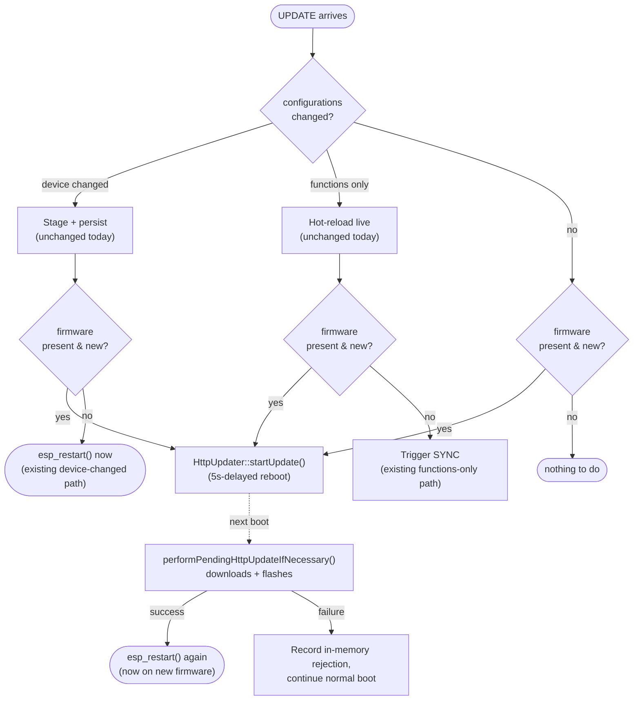

# Mass Firmware Updates — firmware side (`firmware` in `SYNC`/`UPDATE`, OTA trigger, rejection)

> Status: **Spec draft. Nothing implemented yet.** This is the firmware counterpart to the
> server/UX-owning spec in the app repo,
> [`cornucopia-app/docs/specs/firmware-update-en-masse.md`](https://github.com/cornucopia-machines/cornucopia-app/blob/main/docs/specs/firmware-update-en-masse.md)
> — **read that spec first.** It owns the protocol design, the *why* behind every decision, the
> `Device.firmwareState` reconciliation model, and the admin UI (Phase 2, which has **no firmware
> component** — it's backend + frontend only). This document covers only the app spec's **Phase
> 1** from the firmware's side: advertise `firmware` in `SYNC`, accept a firmware `UPDATE` entry,
> trigger the download, roll back and report a rejection if the new firmware doesn't boot cleanly.
>
> One-line summary of the firmware's job: **report `{platform, version}` on every `SYNC`; when an
> `UPDATE` carries a `firmware.url` for a version that isn't what's currently running, hand it to
> the OTA mechanism that already exists for the one-off `commands/update` path; report a rejection
> once, on the SYNC that follows either a failed download/install, or a boot that flashed
> successfully but then had to be automatically rolled back by the bootloader.**

## What the firmware is responsible for (and what it is not)

Exactly the same division of labor as [`config-reconciliation.md`](config-reconciliation.md): the
server is the authority — it decides the target version, holds `requested`/`confirmed` firmware
state, and owns the rollout UX and retry/deadline policy. The firmware's job is deliberately dumb:

- **Report what it's actually running**, unconditionally, on every `SYNC` — never compute or infer
  anything about "should I be on a different version," that's the server's call.
- **Do what it's told** when an `UPDATE` names a different version: download from the given URL,
  install, reboot. No version negotiation, no channel logic, no picking a variant — the server has
  already resolved `platform` + `release` variant to a concrete binary URL before the `UPDATE` is
  sent.
- **Report a rejection once** if the download/install fails, or if the newly-flashed firmware fails
  to boot and gets automatically rolled back, then get out of the way — the server decides whether
  and when to retry, exactly like a config rejection.

### What this spec does *not* cover

- **The admin UI, rollout queue, and `FirmwareRollout` entities** — app spec Phase 2, no firmware
  changes.
- **Legacy pre-SYNC devices** — the existing `commands/update` MQTT command stays exactly as-is.
- **Automatic channels, phased rollouts** — app spec's Follow-ups; no firmware hooks proposed here.
- **A generalized "soaking" confirm-valid window** — waiting for sustained healthy operation (not
  just `kernelReady`) before confirming a change as good, for firmware *and* config changes alike.
  A good follow-up, but out of scope: `kernelReady` is the confirm-valid gate for now (see *OTA
  rollback* below).
- **Cause-classified rejection codes** — firmware rejections default to `Internal`, same posture
  `config-reconciliation.md`'s Phase 3 already has for config rejections.

## What needs to change

| File | Change |
| --- | --- |
| `components/kernel/src/HttpUpdate.hpp` | `performPendingHttpUpdateIfNecessary()` returns `std::optional<RejectionCode>` instead of `void`. |
| `components/devices/src/Device.hpp` | `registerUpdateHandler()`: new `nvs` parameter; parse/validate/skip-if-current `firmware` entry **before** the early returns at `Device.hpp:321-324,334-337`; make those early returns conditional (fall through when firmware is present and new); call `HttpUpdater::startUpdate()` per the *Ordering* table; make the device-changed branch's `esp_restart()` conditional on no firmware entry. `publishSync()`: add `firmware: {platform, version, rejection?}`. `startDevice()`: capture `performPendingHttpUpdateIfNecessary()`'s return value; thread it to `BOOT`'s new `firmwareRejection` and to SYNC via a second `pendingSyncRejection`-style shared optional. |
| new: `components/kernel/src/FirmwareUpdateDecision.hpp` (name tentative) | Pure function(s): parse+validate an `UPDATE`'s `firmware` object, decide whether it's new relative to `firmwareVersion` — natively testable, no NVS/MQTT, mirroring `UpdateFilter.hpp`. |
| `sdkconfig.defaults` (or per-platform sdkconfig) | *(OTA rollback)* `CONFIG_BOOTLOADER_APP_ROLLBACK_ENABLE=y` for both platforms; verify `partitions.csv` still fits. |
| `components/devices/src/Device.hpp` (`startDevice()`) | *(OTA rollback)* `esp_ota_mark_app_valid_cancel_rollback()` once `kernelReady` is set; rollback-detection function alongside `performPendingHttpUpdateIfNecessary()` at `Device.hpp:780`, feeding the same `firmwareRejection` fields. |
| new: `components/kernel/src/FirmwareRollback.hpp` (name tentative) | *(OTA rollback)* `esp_ota_get_last_invalid_partition()` + `esp_ota_get_partition_description()` + `esp_ota_invalidate_inactive_ota_data_slot()` — returns `std::optional<RejectionCode>` and the failed partition's version for `CrashManager`; no NVS involved. |
| `components/kernel/src/CrashManager.hpp` | *(OTA rollback, pre-existing bug fix)* Replace the `nvs["version"]` read/write with: use the rollback-detection version if this boot found a fresh rollback, else `firmwareVersion`. Drops the persisted version-tracking key. |

## Where the firmware is today (grounding)

- **`UD_PLATFORM`** (`"spinach"` or `"carrot"`) and **`firmwareVersion`**
  (`esp_app_get_description()->version`) are already process-wide constants, reported flat on
  `BOOT` (`Device.hpp:927,934`).
- **`registerHttpUpdateCommand()`** (`Device.hpp:270-284`) — the existing one-off OTA command
  (`commands/update` MQTT topic). Validates `request["url"]`, calls
  `HttpUpdater::startUpdate(url, nvs)`, responds `{success: true}`. **Untouched by this spec.**
- **`HttpUpdater`** (`HttpUpdate.hpp`) — a two-reboot, deferred-apply mechanism:
  - `startUpdate(url, nvs)` persists `url` under NVS key `"pending-update"` and spawns a task that
    waits 5s then `esp_restart()`s. Does not download anything itself.
  - `performPendingHttpUpdateIfNecessary(nvs, wifi, watchdog)` runs on the *next* boot
    (`Device.hpp:780`), reads-and-removes the pending key, waits up to 15s for WiFi, then does
    `esp_https_ota()`. On success: 5s delay, `esp_restart()` (now on new firmware). On failure:
    logs and returns — boot continues on unchanged firmware. **Neither outcome is reported over
    MQTT today.**
- **`registerUpdateHandler()`** (`Device.hpp:313-406`) — the config-reconciliation `update`-topic
  handler. This is where the new `firmware` entry gets read from the same `UPDATE` message.
- **`publishSync()`** (`Device.hpp:421-440`) — builds the `sync` payload from
  `FunctionRegistry::manifest()` plus an optional `rejection`. This is where the new top-level
  `firmware` object gets added.
- **Rejection reporting pattern** — `RejectionCode` (`ConfigState.hpp:39-45`), a
  `google.rpc.Code`-numbered enum. `startDevice()` reads a persisted rejection once, clears it,
  and hands the in-memory value to both `BOOT` and this boot's first `SYNC` (via
  `pendingSyncRejection`, `Device.hpp:776,902-908`).
- **No app-partition rollback is enabled today.** `CONFIG_BOOTLOADER_APP_ROLLBACK_ENABLE` and
  `CONFIG_APP_ROLLBACK_ENABLE` are both unset; `esp_ota_mark_app_valid_cancel_rollback()` is
  called nowhere. A newly-flashed OTA partition is unconditionally treated as valid.
- **ESP-IDF rollback APIs** (verified against vendored IDF 6.0.2, `esp_ota_ops.h`):
  - A freshly-flashed partition starts `ESP_OTA_IMG_NEW`; the bootloader flips it to
    `PENDING_VERIFY` on first boot; `esp_ota_mark_app_valid_cancel_rollback()` → `VALID`;
    reset while still `PENDING_VERIFY` → bootloader sets `ABORTED` and boots the other partition.
  - `esp_ota_get_last_invalid_partition()` — returns the partition last left `INVALID`/`ABORTED`
    (`NULL` if none).
  - `esp_ota_get_partition_description(partition, &desc)` — reads `esp_app_desc_t` (including
    `.version`) straight from flash, works on partitions that never successfully booted.
  - `esp_ota_invalidate_inactive_ota_data_slot()` — erases the `otadata` select record for the
    inactive slot (app partition content untouched), which makes
    `esp_ota_get_last_invalid_partition()` return `NULL` afterward.

## `SYNC`: report `firmware`

Every `SYNC` gains an unconditional top-level `firmware` object:

```jsonc
{
  "configurations": { /* unchanged */ },
  "firmware": {
    "platform": "spinach",   // UD_PLATFORM
    "version": "0.50.2"      // firmwareVersion
  }
}
```

Change in `publishSync()`: add `json["firmware"]["platform"] = UD_PLATFORM;
json["firmware"]["version"] = firmwareVersion;` inside the existing publish lambda. Both values are
already in scope. See *Rejection reporting* for the `rejection` field.

`BOOT` is **not changed** beyond rejection reporting — it already reports `platform`/`version`
flat for diagnostics; the app spec's rationale for putting them in `SYNC` too stands on its own.

## `UPDATE`: handling a `firmware` entry

```jsonc
// server → device, inside the existing `update` topic message
{
  "configurations": { /* unchanged — may be empty if only firmware is stale */ },
  "firmware": {
    "version": "0.50.2",
    "requestedAt": "2026-08-05T…",
    "url": "https://r2.…/releases/0.50.2/ugly-duckling-spinach-release.bin"
  }
}
```

`registerUpdateHandler()` gains, alongside its existing `configurations` handling:

1. **Parse and validate.** Read `request["firmware"]`. If absent, nothing to do. If present but
   missing/empty `url` or `version`, log and ignore the entry — don't let a malformed firmware
   entry stop the `configurations` half of the same `UPDATE` from applying.
2. **Skip if already running it.** If `firmware.version == firmwareVersion`, ignore the entry — a
   defensive no-op mirroring `filterUpdate`'s fingerprint-skip. Pulling this comparison into its
   own pure function (see *Tests*) keeps it natively testable.
3. **Trigger the download.** Otherwise, call `HttpUpdater::startUpdate(firmware.url, nvs)`.
   `registerUpdateHandler` needs a new `std::shared_ptr<NvsStore>` parameter for this.

`requestedAt` is ignored if present — unlike a config envelope's `requestedAt`, it is never
persisted or echoed back; `SYNC`'s `firmware` only reports `{platform, version}`.

### Control flow: surviving the existing early returns

`registerUpdateHandler`'s current body has two early returns before `configurations` gets acted
on: `if (configurations.isNull()) return;` (`Device.hpp:321-324`) and
`if (update.changed.empty()) return;` (`Device.hpp:334-337`). A firmware-only `UPDATE` —
`configurations: {}` — trips the second guard, silently dropping the firmware entry.

**Both early returns must become conditional**: they fall through (instead of returning) when
steps 1–2 above determined that a valid, non-current firmware entry is present. Concretely,
steps 1–2 run at the very top of the handler (before either early return), producing a
`std::optional<std::string>` firmware URL. If that optional has a value and both early returns
would otherwise fire, control falls through to step 3 instead. Step 3 (`startUpdate()`) itself
fires at the point the *Ordering* table below specifies — immediately when there's no config
work, or after config staging/hot-reload when there is.

### Ordering: config and firmware in the same `UPDATE`

The app spec requires config to apply first, then firmware to start downloading. This means not
doubling up on reboots when both are present in one message:

| Config in this `UPDATE` | Firmware in this `UPDATE` | What happens |
| --- | --- | --- |
| none, or functions-only applied live | none | unchanged today: hot-reload, no reboot |
| device changed | none | unchanged today: `esp_restart()` immediately (`Device.hpp:371`) |
| none | present | call `HttpUpdater::startUpdate()` — its delayed `esp_restart()` is the only reboot |
| functions-only, applied live | present | hot-reload commits live, *then* `HttpUpdater::startUpdate()` — its delayed reboot starts the download cycle |
| device changed | present | config is staged/persisted as today, but instead of the immediate `esp_restart()` at line 371, call `HttpUpdater::startUpdate()` — its 5s-delayed reboot picks up the staged config *and* leads into the firmware download on the boot after that |

The last row is the one behavior change to existing code: the device-changed branch's
`esp_restart()` must become conditional — skip it and call `startUpdate()` instead when a firmware
entry is present, since `HttpUpdater`'s own restart already achieves the reboot the config change
needs.



## Rejection reporting

`performPendingHttpUpdateIfNecessary()` currently returns `void` and just logs on failure
(`HttpUpdate.hpp:91-95`). Change it to return `std::optional<RejectionCode>` — `std::nullopt` when
there was nothing pending or it succeeded (success reboots immediately, so there's no boot session
left to report from), a code on failure. `startDevice()` captures this at `Device.hpp:780` and
carries it forward to the same two publish points config rejections already use:

- **`BOOT`** gets a new optional top-level `firmwareRejection` field (separate from the existing
  config-scoped `rejection` — see *Resolved decisions* #1), included whenever this boot detected a
  failed download/install. The app spec only asks for reporting via `SYNC`; echoing it on `BOOT` is
  a robustness addition — a device that never reaches a live MQTT window long enough for SYNC still
  tells the server something went wrong.
- **`SYNC`** gets `firmware.rejection` (nested, not the config `rejection` field):
  ```jsonc
  { "firmware": { "platform": "spinach", "version": "0.50.1", "rejection": 13 } }
  ```
  Note `version` is still the *old*, still-running version — a failed install never changes what's
  actually running.

Both are cleared after being read once, threading through an in-memory optional exactly like
`pendingSyncRejection` (`Device.hpp:776,902-908`) — no NVS persistence needed, because the
download failure is detected in the same boot session that publishes `BOOT`/`SYNC`.

**Both sources — a failed download and a rollback (below) — feed the same `firmwareRejection`
field.** These two cannot co-occur in practice: a failed download never writes a new partition, so
there's nothing for the bootloader to roll back from. If both detection paths somehow fire in the
same boot (shouldn't happen, but defense in depth), the rollback takes priority — it's the more
severe signal.

**Cause classification is out of scope for Phase 1.** Every firmware rejection reports
`RejectionCode::Internal` for now — the app spec's example (`ABORTED`, code 10) would need that
value added to the enum, deferred alongside config's own open cause-classification work.

**Known limitation: rejections don't identify which requested version failed.** A `SYNC` reporting
`firmware: {version: "0.50.1", rejection: 13}` tells the server "still on 0.50.1, something
failed," but not *which* candidate version was rejected. If the server sent two successive
requests before seeing this rejection, it can't distinguish which one failed. This is the same
ambiguity config rejections have — acceptable for now, addressable later alongside
cause-classified rejection codes.

## OTA rollback: detection, confirm-valid gate, and rejection reporting

Originally scoped as an optional fast-follow (tracked as
[#587](https://github.com/cornucopia-machines/ugly-duckling-firmware/issues/587)) — now **in scope
for this spec**, because reporting a rollback is part of the same wire-format contract as reporting
a failed download. Today, nothing protects against firmware that flashes successfully but then
fails to boot — there is no `CONFIG_BOOTLOADER_APP_ROLLBACK_ENABLE`. A single manual
`commands/update` gone wrong means one unreachable device; a mass rollout multiplies that blast
radius with **zero automatic recovery and zero reporting**.

**1. Enable the bootloader-level rollback.** `CONFIG_BOOTLOADER_APP_ROLLBACK_ENABLE=y` in
`sdkconfig` for both platforms. A freshly-flashed partition then boots `PENDING_VERIFY`; if the
device resets again before confirming, the bootloader reverts on its own. Verify `partitions.csv`
still fits (adds bootloader-managed state, not a new partition).

**2. Confirm valid at `kernelReady`, for now.** `esp_ota_mark_app_valid_cancel_rollback()` once
`states->kernelReady` is set (`Device.hpp:956`). This is deliberately not the strongest signal:
`kernelReady` doesn't require a live MQTT connection, so a firmware with a networking regression
would still confirm and never roll back. Accepted for now — closing that gap wants the generalized
"soaking" confirm-valid window noted under *What this spec does not cover*.

**3. Detect a rollback on the boot that follows it, and report it.** The failing boot never
publishes anything — it may crash before any app code runs — so detection happens on the *next*
boot by reading what the bootloader already recorded:

- Early in `startDevice()`, alongside `performPendingHttpUpdateIfNecessary()` (`Device.hpp:780`),
  call `esp_ota_get_last_invalid_partition()`. `NULL` (the overwhelming majority of boots): nothing
  to do. Non-`NULL`: a rollback happened and hasn't been handled yet.
- Read that partition's version via `esp_ota_get_partition_description()` — the version is baked
  into the image itself, readable from a partition that never successfully booted, no NVS
  write-before-risky-reboot needed.
- Build a `RejectionCode::Internal` and feed it into the same `firmwareRejection` /
  `firmware.rejection` fields defined above. As with a failed download, `firmware.version` on that
  `SYNC` is the old, still-running (rolled-back-to) version.
- **Then call `esp_ota_invalidate_inactive_ota_data_slot()` to clear the marker.**
  `esp_ota_get_last_invalid_partition()` doesn't clear itself on read; without this, the same
  rollback would be reported on every boot until the next OTA attempt overwrites that slot.
  Calling it here erases only the `otadata` select record for the inactive slot (app partition
  content untouched), making `esp_ota_get_last_invalid_partition()` return `NULL` on subsequent
  boots. ESP-IDF also calls this internally from `esp_ota_begin()` when a new OTA write starts,
  but the next OTA attempt could be weeks away.

**4. Fix `CrashManager`'s version attribution (pre-existing bug).**
`CrashManager::handleCrashReport()` (`CrashManager.hpp`) currently stamps
`nvs["version"] = firmwareVersion` only from inside a successful `BOOT` publish (`Device.hpp:952`).
A firmware that crashes before reaching that line leaves the next boot's crash report blaming
whichever version the *last successful boot* wrote — i.e. the old, innocent firmware, not the one
that actually crashed. **This is already wrong today**, independent of the rollback work; the
rollback detection just provides a clean fix: when a coredump exists *and* this same boot found a
rollback, attribute the crash to that partition's version (from point 3's
`esp_ota_get_partition_description()` read); otherwise attribute it to `firmwareVersion`. This
removes the need for `CrashManager`'s own persisted version-tracking key entirely.

**Residual edge case:** a device could have pre-existing `otadata` history from a dev/test cycle
where rollback was briefly enabled by hand — its first boot with this code would report that as a
rollback once, then immediately invalidate the slot, self-correcting on that same boot. Production
devices can't have this history: rollback has never been enabled before.

This can land independently of the `SYNC`/`UPDATE` wire-format work — nothing else in this spec
depends on it, but the fleet-wide blast radius is what makes it worth doing *before* the admin UI
(app spec Phase 2) starts pushing mass rollouts for real.

## Migration

Purely additive: no existing NVS key, message shape, or stored state changes meaning. A device
running old firmware simply doesn't send `firmware` in `SYNC` — exactly the case the app spec's
server-side reconciliation already handles. OTA rollback introduces no NVS state either (see
*Residual edge case* for the one harmless, self-correcting exception).

## Tests

Following this codebase's established tiering:

- **Native (`unit-tests`).** The new pure decision function(s) in `FirmwareUpdateDecision.hpp`:
  missing/empty `url`/`version` → ignored; `version` equal to the current one → ignored;
  otherwise → returns the URL to hand to `HttpUpdater`.
- **Embedded (`embedded-tests`, Wokwi, no broker).** **OTA rollback is testable at this tier** per
  [#587](https://github.com/cornucopia-machines/ugly-duckling-firmware/issues/587)'s own testing
  note: flash a deliberately-broken local image that panics immediately, assert the device rolls
  back, resumes normal MQTT reporting, and the following `SYNC` carries `firmware.rejection`. No
  real network fetch needed — just a locally-built bad image.
- **e2e (`e2e-tests`, Wokwi + Mosquitto).** Blocked on
  [#596](https://github.com/cornucopia-machines/ugly-duckling-firmware/issues/596) (no MQTT client
  in the e2e harness) plus a reachable dummy binary for the download itself. Until both exist:
  manual test only.

## Resolved decisions

1. **`firmware.rejection` on `SYNC` is separate from the existing top-level `rejection`** — config
   and firmware are independent reconciliation domains that can both have a pending rejection in the
   same boot (e.g. a device reverted a bad config *and* failed a firmware download). A single
   shared field can't represent both. This needs a corresponding note in the app-side spec — its
   current wire-format example doesn't show a `rejection` key under `firmware`.
2. **The device-changed `UPDATE` branch's reboot becomes conditional** on whether a firmware entry
   is also present, to avoid a redundant extra reboot (see *Ordering* table). This is the one
   behavior change to existing config-reconciliation code.
3. **OTA rollback is in scope, not a deferred fast-follow** — reporting a rollback-triggered
   rejection is part of the same wire-format contract as reporting a failed download.

## Open decisions

1. **`ABORTED`/cause-classified rejection codes** — deferred; needs the same decision
   `config-reconciliation.md`'s Phase 3 already has open for config rejections, extended to cover
   firmware-specific failure modes.
2. **Exact names/locations of the new headers** (`FirmwareUpdateDecision.hpp`,
   `FirmwareRollback.hpp` — both tentative above) — naming call at implementation time.

## Exit criteria

- [ ] Every `SYNC` includes `firmware: {platform, version}`.
- [ ] An `UPDATE` with a valid, new `firmware.url` triggers `HttpUpdater::startUpdate()` — including
      when `configurations` is empty or has nothing new (i.e. not swallowed by `registerUpdateHandler`'s
      existing early returns). One with a `firmware.version` matching the currently-running version
      is a no-op; a malformed entry is logged and ignored without blocking the `configurations` half
      of the same `UPDATE`.
- [ ] A device-changed `UPDATE` that also carries a new firmware entry reboots exactly once into the
      new config, then downloads and installs firmware on the following boot (no double reboot).
- [ ] A functions-only `UPDATE` that also carries a new firmware entry hot-reloads live, then starts
      the firmware download without waiting for a reconnect.
- [ ] A failed download/install reports `RejectionCode::Internal` once, on `SYNC`'s
      `firmware.rejection` (and `BOOT`'s `firmwareRejection`), then clears it — a later `SYNC`/`BOOT`
      in the same boot session doesn't repeat it.
- [ ] The legacy `commands/update` command and its `responses/update` behavior are unchanged.
- [ ] A firmware image that flashes but crash-loops (or hangs before `kernelReady`) reverts
      automatically to the previous partition, with no operator intervention.
- [ ] The boot that follows an automatic rollback reports `RejectionCode::Internal` once, on that
      `SYNC`'s `firmware.rejection` (and that `BOOT`'s `firmwareRejection`) — same fields, same
      once-only semantics as a failed download/install — via `esp_ota_invalidate_inactive_ota_data_slot()`,
      not a new NVS marker, then doesn't repeat it on later boots.
- [ ] A crash report for a boot that immediately follows a rollback blames the version that actually
      crashed (read from the failed partition), not the version rolled back to; a crash report with
      no accompanying rollback blames the current, live `firmwareVersion`.
